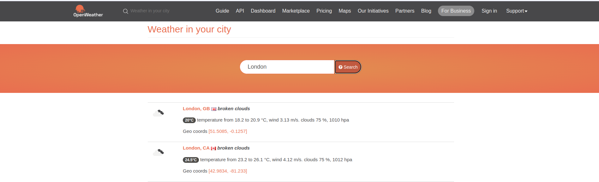

# Change weather location
If you want to change the display weather to your location keep following:
### 1. Go to `openweathermap`
https://openweathermap.org/find
### 2. Search for you location
Select your location

And copy its location's `id`

`https://openweathermap.org/city/2643743`'s id is `2643743`
### 3. Replace id in script
```
vim ~/.config/conky/Mimosa/scripts/weather-v2.0.sh
```
> city_id=2643743
### 4. Restart the widget