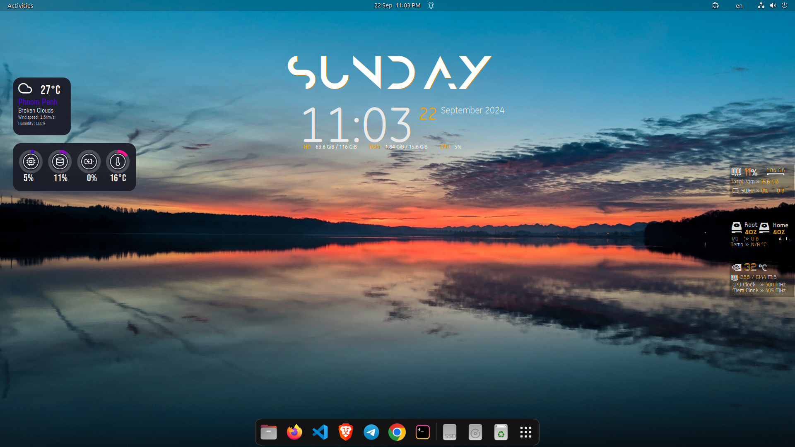
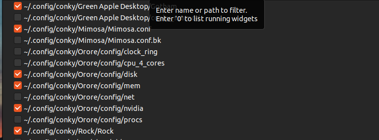
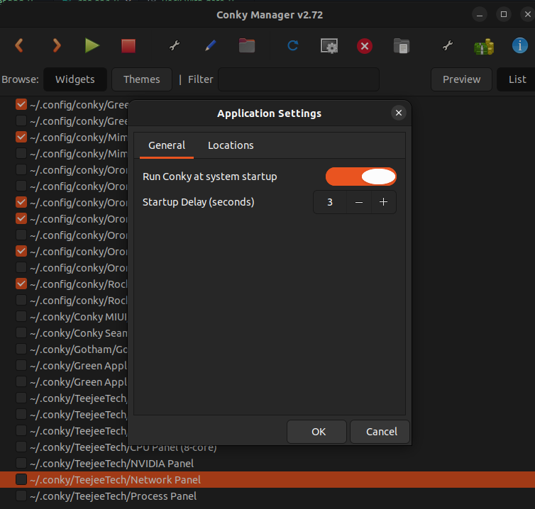

# conky-desktop
Conky is a versatile system monitoring tool for Ubuntu that seamlessly combines beauty with efficiency. Its visually appealing display of real-time system information adds a touch of elegance to your desktop. 
Please enjoy with easy setup 🤩🤩🤩

## Ubuntu  

### 1. Setup
#### Automation
You can just run only a command to set theme up.
```
sudo ./setup.sh
```

#### Manual Set up 
**1. Install Conky and Conky manager**
```
sudo add-apt-repository ppa:teejee2008/foss
sudo apt update -y
sudo apt install -y conky conky-manager2
```
[Conky manager's repository](https://github.com/zcot/conky-manager2)

**2. Install fonts**
```
cp -i fonts/* ~/.fonts/
```
**3. Place the widgets**
```
mkdir -p ~/.config/conky
cp -ir conky/* ~/.config/conky
cp -i conky-manager2json ~/.config/
```
### 2. Open CM2
Just start the application

### 3. Select the widgets
Select as you like

### 4. Run at startup
To enable selected widget startup everytime you open you computer. You can make it delayed if your computer has small specs.
; Fast computer should be: `< 5` seconds
; Slow computer should be: `> 5` seconds.


___

## Additional
[Relocate your weather to yours](./Change-weather.md)